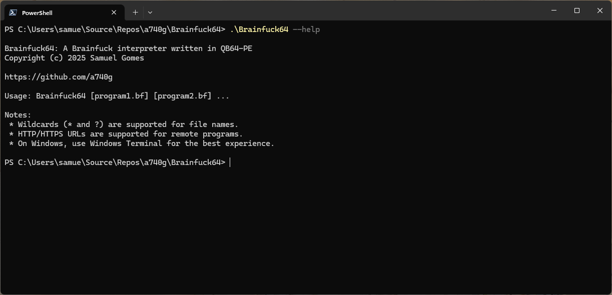
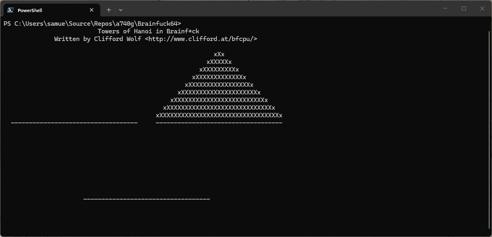
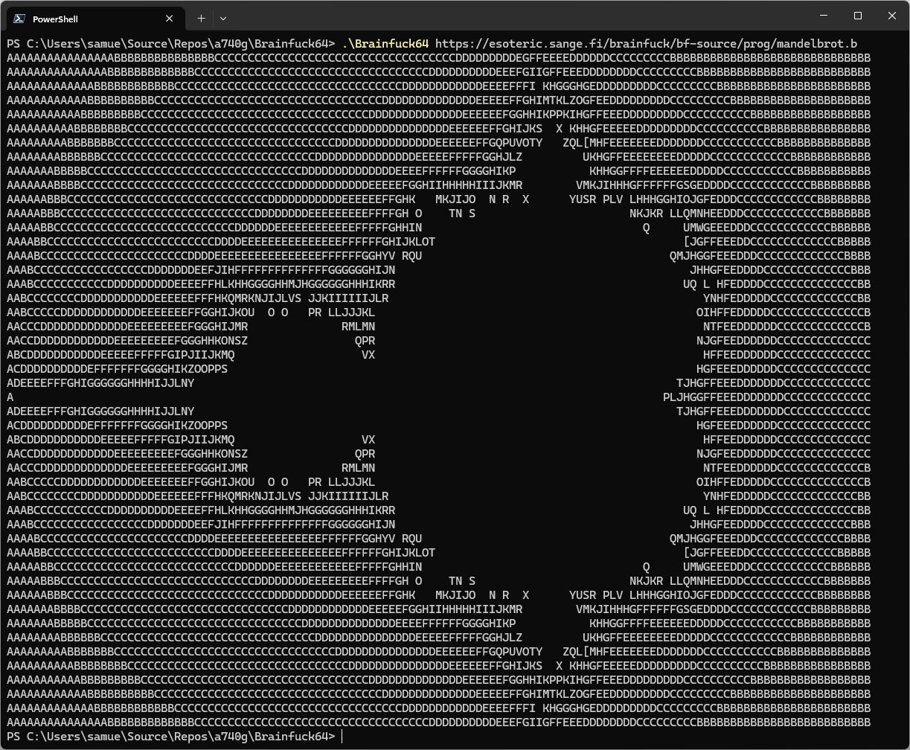

# Brainfuck64

Brainfuck64 is a [Brainfuck](http://en.wikipedia.org/wiki/Brainfuck) interpreter written in [QB64-PE](https://www.qb64phoenix.com/).





## Usage

You can run a Brainfuck program by passing its path or URL as a command-line argument:

```bash
./Brainfuck64 program.bf
```

If run without arguments, a file selection dialog will appear.

## Building

### Requirements

* The [latest version](https://github.com/QB64-Phoenix-Edition/QB64pe/releases/latest) of the [QB64-PE](https://www.qb64phoenix.com/) compiler.

### Build Instructions

1. Clone the repository with submodules:

    ```bash
    git clone --recursive https://github.com/a740g/Brainfuck64.git
    cd Brainfuck64
    ```

2. Build using the provided `Makefile`:

    ```bash
    make
    ```

    *On Windows, you may need to use `mingw32-make`.*

## Testing

A test suite is included to verify the interpreter's correctness.

```bash
make test
```

## References

* [Esolang &ndash; Brainfuck](http://esolangs.org/wiki/brainfuck)
* [Wikipedia &ndash; Brainfuck](http://en.wikipedia.org/wiki/Brainfuck)
* [BFBASIC &ndash; BASIC to Brainfuck Compiler](https://esolangs.org/wiki/BFBASIC)

## License

This project is licensed under the MIT License - see the [LICENSE.txt](LICENSE.txt) file for details.
