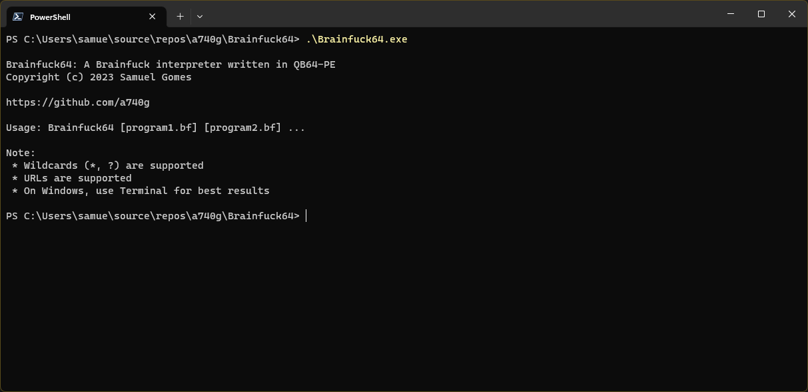
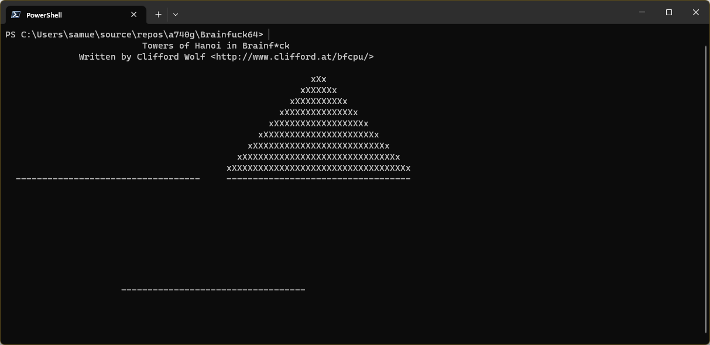

# BRAINFUCK64

This is a [Brainfuck](http://en.wikipedia.org/wiki/Brainfuck) interpreter written in QB64-PE.

## USAGE

* Clone the repository to a directory of your choice
* Open Terminal and change to the directory using an appropriate OS command
* Run `git submodule update --init --recursive` to initialize, fetch and checkout git submodules
* Open *Brainfuck64.bas* in the QB64-PE IDE and press `F5` to compile and run
* Pass the Brainfuck program to execute as a command line parameter

## BIBLIOGRAPHY

* [Esolang &ndash; Brainfuck](http://esolangs.org/wiki/brainfuck)
* [Wikipedia &ndash; Brainfuck](http://en.wikipedia.org/wiki/Brainfuck)
